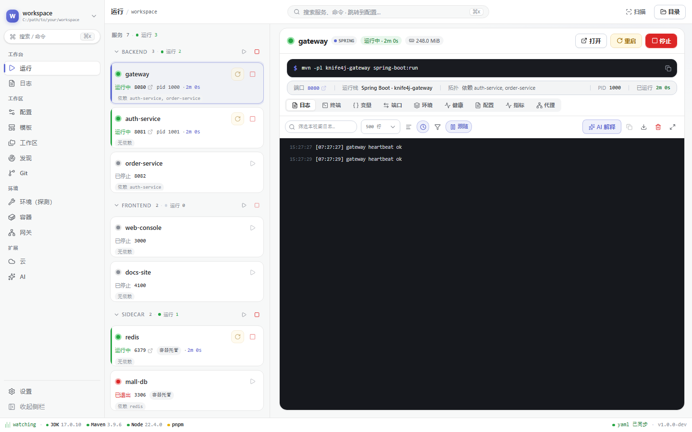

# SuperTask

**一份 `supertask.yaml`,一键拉起、一键收场你机器上的所有服务。**

本地优先 · Tauri 2 + Rust(不是 Electron)· Windows 优先,macOS / Linux 可用

[](https://github.com/shenlq1017/super-task/actions/workflows/ci.yml)

SuperTask 的主要交付形态是可视化桌面应用，Windows 下为 EXE。
README 里提到的「页面」均指桌面应用内的可视化工作台。

---

AI 时代带来了一个意想不到的副作用:
**越来越多的服务,不是你启动的。**

AI 助手为了「帮你验证」,拉起了一堆服务;
你关掉窗口,服务还在跑。
端口被占着,内存被吃着,而你甚至不知道怎么把它停下来。

老问题也一个都没少:

- 后端是 Spring Boot 多模块,而你是前端——想把栈拉起来,先背一套 Maven 咒语;
- 新项目交接,README 只写了「本地跑一下就行」,端口撞了没人负责;
- 启动命令散落在五个终端里,明天你就会忘记谁是谁。

**SuperTask 就是为「快速启动服务」而生的。**
服务和代码早就躺在你的机器上,SuperTask 只是把它们的启动方式
记进一份 `supertask.yaml`——从此一键或一条命令拉起整个栈:
按顺序、等健康、聚日志;收工时,一键清掉整棵进程树。

## 30 秒上手桌面应用

打开 SuperTask 桌面应用后，大多数操作都可以直接在可视化工作台完成，不需要先写脚本。
用内置 Demo 工作区可以快速体验完整流程:

```bash
npm ci
npm --prefix frontend ci
npm run tauri:dev
```

如果已安装发行版，直接双击 `SuperTask.exe` 即可；上面的命令用于从源码启动桌面应用。

应用启动后，在「打开工作区」中选择 `examples/node-demo/`，点击「启动全部」。
这个 Demo 只有 Node 前置要求，不需要先安装 Maven 或 Docker；进入后可以切换服务、
查看健康状态和聚合日志，再点击「停止全部」收场。



桌面应用已经覆盖常用流程:

- 工作区:打开目录、最近工作区、扫描项目生成配置、导入/导出工作区包;
- 运行:启动/重启/停止单个服务或全部服务，查看端口、健康检查、环境和实时日志;
- 配置:表单编辑 `supertask.yaml`，也可以切换到 YAML 视图;
- 环境、网关、容器、Git、AI:按需使用，不影响最基本的本地启动流程。

CLI 和 MCP 作为桌面应用之外的辅助入口，用于自动化、CI 和 AI 编辑器接入，
与桌面端共用同一份工作区模型。

需要把配置纳入 git 时，直接在桌面应用的配置页编辑并保存 `supertask.yaml`；
也可以手写后再由桌面端打开。

## 起得来 — 一键拉起既有项目

- 指向目录,或一条 `supertask up`:整个栈按依赖顺序启动,等健康检查通过才算起来;失败自动清场,不留半截栈。
- 启动方式在 yaml 里声明一次,直接进 git——新人入职第二天不用再问人。
- 懒得写:扫描 `pom.xml` / `package.json` 生成草稿,或者干脆让它读项目的 README。
- 六种服务通吃:Spring Boot(Maven 多模块)、Node、Python、Go、Docker Compose,以及任何叫得上名字的程序。
- 启动顺序、端口、健康检查全在文件里——每次都一样地起来。
- 不懂对方的工具链也没关系:`doctor` 告诉你缺什么,JDK / Maven / Node 可经 mise / winget 装好——前端也能一键拉起后端。

## 看得见 — 每个服务,一目了然

- 聚合日志、可搜索、可导出;不用再在终端之间来回切。
- 状态、CPU / 内存、端口占用尽收眼底;端口撞了,一键改完写回 yaml。
- 一键打开 Cursor / IDEA / VS Code,顺手看 git 分支与状态。

## 停得掉 — 走的时候,不留残渣

- 一键杀整棵进程树,子进程也不例外;`down` 之后,端口是真的释放了。
- 让 Cursor / Claude 通过 MCP 管理服务:编辑器一关,服务随之清场——AI 时代,不该有孤儿进程。
- 需要自动化或接入 CI 时，再使用 CLI 作为桌面应用的辅助入口。

## 带得走 — 工作区跟着你跑

- 导出 / 导入 zip,换台机器拉起来接着干。
- 网关配置(nginx / caddy / apache)也从这份 yaml 生成,带本机校验与一键 HTTPS。
- 云同步可选:密钥默认**不**上云——想同步,得你自己勾选。
- AI 辅助也可选:解释日志、补健康检查,用你自己的 Key,只提建议不动手。

## 和你现在用的比

| | 几个终端 | docker compose | Shell / 任务脚本 | AI 自己拉 | SuperTask 桌面 EXE |
|---|---|---|---|---|---|
| 可视化工作台 | ❌ | 第三方 UI | ❌ | ❌ | ✅ |
| 按依赖顺序启动 | 自己记 | ⚠️ 只排序,不等就绪 | 手写 | 指望不上 | ✅ |
| 健康通过才算起来 | 手动 curl | ⚠️ 能配,Java 栈不好写 | 手写 | ❌ | ✅ |
| 聚合日志与状态 | 散在 N 个窗口 | `docker logs` 逐个看 | ❌ | ❌ | ✅ |
| 一键停止、无残留 | 逐个杀,Windows 常杀不掉子进程 | ✅ | 手写 | ❌ 工具关了服务还在 | ✅ |
| Spring Boot 热重载 / 调试 | ✅ | 得先容器化,Windows 卷挂载慢 | ✅ | ✅ | ✅ 宿主机直接跑 |
| 启动知识进仓库 | ❌ 在人脑里 | ✅ compose.yml | ✅ 在脚本里 | ❌ | ✅ `supertask.yaml` |
一句话:**用桌面工作台管理宿主机裸进程,同时拥有 compose 的声明、顺序与清场语义**。
容器只是六种服务之一,不是前提;AI 起的服务,也有人负责收场。

## 和相似开源项目的区别

这些项目都很成熟，SuperTask 不试图替代它们的强项。区别在于默认工作流:
它们通常解决「执行任务」「管理容器」或「守护某类进程」中的一个问题，
SuperTask 解决的是**已经存在的本机多服务项目，如何让团队用桌面应用一键启动、观察并完整收场**。

| 开源项目 | 它更擅长的场景 | SuperTask 的区别 |
|------|------|------|
| [Docker Compose](https://github.com/docker/compose) | 声明和编排容器、网络与卷 | 不要求先容器化；把宿主机上的 Spring Boot、Node、Python、Go 进程作为一等公民，同时也能管理 Compose 服务 |
| [orckit](https://github.com/dominicbartl/orckit) | YAML 编排、依赖启动、健康检查、仪表盘和 MCP | 更偏 CLI/TUI 开发者工具；SuperTask 以桌面应用为主，理解 Spring Boot module，优先解决 Windows 本机进程的启动与清场 |
| [Taskfile](https://github.com/go-task/task) | 用 YAML 定义可复用的一次性任务 | `scripts` 只是辅助；SuperTask 重点监管长期运行的 service，提供启动顺序、健康通过、日志、状态和停止语义 |
| [Just](https://github.com/casey/just) / Make | 轻量命令入口和构建任务 | 不需要记命令或打开终端；桌面应用的表单、服务卡片和 YAML/CLI/MCP 共用同一份配置 |
| [PM2](https://github.com/Unitech/pm2) | Node.js 进程守护、日志和集群 | 不局限于 Node；对 Spring Boot 多模块、跨语言依赖、端口和健康检查做工作区级管理，桌面端可视化查看 |
| [Overmind](https://github.com/DarthSim/overmind) | 基于 Procfile 的多进程终端工作流 | SuperTask 有结构化服务模型和桌面状态面板，能表达服务类型、依赖、健康检查，并在 Windows 上清理整棵进程树 |
| [Dockge](https://github.com/louislam/dockge) | Docker Compose 的可视化管理界面 | Dockge 的边界是 Docker Compose；SuperTask 的核心场景是本机代码项目，Docker 只是可选的一种服务类型 |
| [Tilt](https://github.com/tilt-dev/tilt) | 容器 / Kubernetes 的本地开发工作流 | 更适合云原生和容器开发；SuperTask 更轻，面向 Windows 本机已有的 Java + Node 项目，不要求引入容器平台 |
| [Runme](https://github.com/runmedev/runme) | 把 Markdown 里的命令变成可执行 runbook | SuperTask 可以从 README 导入启动草稿，但最终产物是可持续监管的工作区，而不是一次次执行 Notebook 单元 |

### SuperTask 的核心优势

- **宿主机优先**:不改变项目的运行方式，不为本地调试强行增加 Docker 层。
- **跨语言且懂 Spring**:同一个工作区可以混合 Maven 多模块、Node、Python、Go 和 Compose，依赖关系、端口和健康检查统一管理。
- **桌面应用优先但不锁定**:新人点击 EXE 内的工作台即可上手，熟悉命令行的人继续用 YAML、CLI 和 MCP，三者不会维护三套配置。
- **启动和收场是一对语义**:依赖服务健康后才继续启动；停止时沿着进程树清理，减少 Windows 上端口占用和孤儿进程。
- **把排查信息放在同一处**:服务状态、CPU/内存、端口、环境和聚合日志围绕当前工作区展示，减少在多个终端和 IDE 窗口之间切换。

选择建议很简单:只跑容器选 Docker Compose / Dockge；只跑一次性命令选 Taskfile / Just；只守护 Node 进程选 PM2；如果要把现有的本机多语言项目变成可点击、可观察、可收场的桌面工作区，选 SuperTask。

## 示例工作区

[`examples/`](examples/) 里有四个开箱即用的工作区,桌面端「打开工作区」指向对应目录即可:

| 目录 | 覆盖场景 | 前置要求 |
|------|----------|----------|
| `spring-multi/` | Maven 多模块:拓扑启动、健康检查、改端口、脚本、构建 jar | JDK 17+、Maven |
| `node-demo/` | Node 基线:启停、日志、健康、脚本(零依赖,离线可跑) | Node |
| `gateway-demo/` | nginx / caddy / apache 网关、路由、本机 HTTPS | Node;网关引擎按需 |
| `compose-demo/` | compose 起停、镜像构建 | Docker Desktop |

## 构建与开发

正式安装包会随 GitHub Release 发布。在那之前,从源码跑起来比你想的快:

```bash
git clone https://github.com/shenlq1017/super-task && cd super-task
npm ci                 # 根目录 Tauri CLI
npm --prefix frontend ci
npm run tauri:dev      # 启动桌面应用
```

CLI 与测试:

```bash
cargo build -p supertask-cli    # bin: supertask
supertask doctor                # 看看你的机器还缺什么
cargo test -p supertask-core    # 引擎测试
```

要求:Rust stable、Node 20+,以及你想跑的服务各自需要的东西
(比如跑 Spring 需要 JDK 17 + Maven)。Tauri 平台依赖见
[官方文档](https://tauri.app/start/prerequisites/)。

测试基线:引擎 455 / CLI 20 / 云服务 14,
CI 在 Windows、macOS、Linux 三平台跑。

## 云参考服务(自托管)

仓库包含独立的实验性自托管参考服务端 `crates/supertask-cloud-server`,
用于协议联调和本地自托管:账号、配额、管理面与自带控制台。
它不是 SuperTask 官方线上服务,也不是生产级部署方案。公网部署前必须自行配置 HTTPS、反向代理、访问控制、数据库备份和密钥轮换。

```bash
cargo run -p supertask-cloud-server        # 默认 127.0.0.1:8787
npm run console:dev                        # 控制台开发模式
```

完整配置与边界见 [docs/spec/cloud-server.md](docs/spec/cloud-server.md);
Windows 下一键拉起两端:`start-cloud.ps1`。

## 路线图

| 版本 | 主题 | 状态 |
|------|------|------|
| 1.0 – 1.7 | 能跑 / 能带走 / 能养活 / 能装箱 / 能出门 / 能搬家 / 能对外 / 能扩 | ✅ 已落地 |
| 2.0 – 2.1 | 能上云(账号、同步、迁移)/ 能读文档(README 导入、AI) | 🚧 功能已实现,真机验收与正式部署进行中 |
| 2.2 | 能长:插件(自定义 kind)、WSL2 | 🌱 规划中 |

## 文档

- YAML 规范:[docs/spec/yaml.md](docs/spec/yaml.md)
- IPC 契约:[docs/spec/ipc.md](docs/spec/ipc.md)
- 架构:[docs/spec/architecture.md](docs/spec/architecture.md)
- CLI 与 MCP:[docs/spec/cli.md](docs/spec/cli.md)
- 云客户端协议:[docs/spec/cloud.md](docs/spec/cloud.md) · 云参考服务:[docs/spec/cloud-server.md](docs/spec/cloud-server.md)
- 系统盘点(现状真源):[docs/inventory/](docs/inventory/)
- 贡献指南:[CONTRIBUTING.md](CONTRIBUTING.md)

## 参与

- 报错、提需求:Issue;改代码:PR。
- 动手前建议先读 [CONTRIBUTING.md](CONTRIBUTING.md) 和 [docs/inventory/](docs/inventory/),那里记着开发约定、系统现状与欠账。

## 致谢

- 网关路由配置模型借鉴 [nginxconfig.io](https://github.com/digitalocean/nginxconfig.io)(DigitalOcean,MIT),按本机开发场景裁剪,未引入其代码。
- 网关页交互思路借鉴 [nginxWebUI](https://github.com/cym1102/nginxWebUI)(GPL),未引入其代码。

## License

SuperTask is released under the [MIT License](LICENSE).
